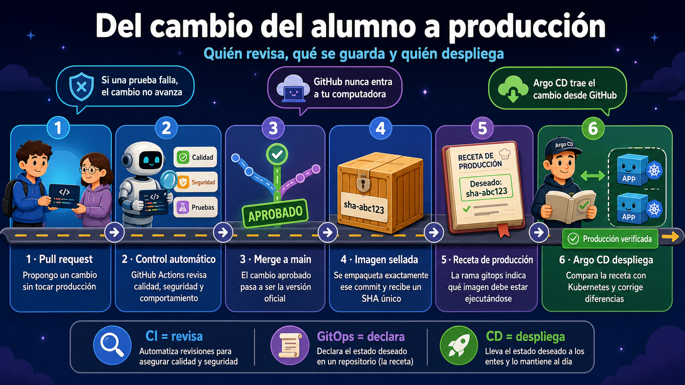
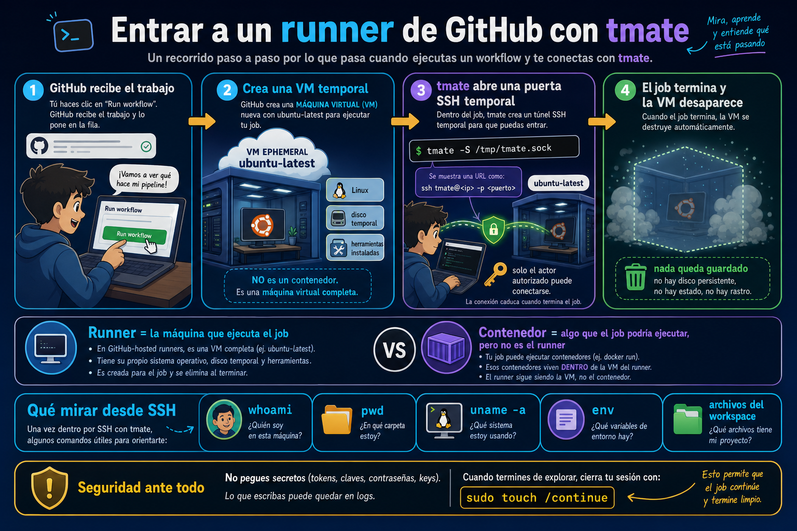
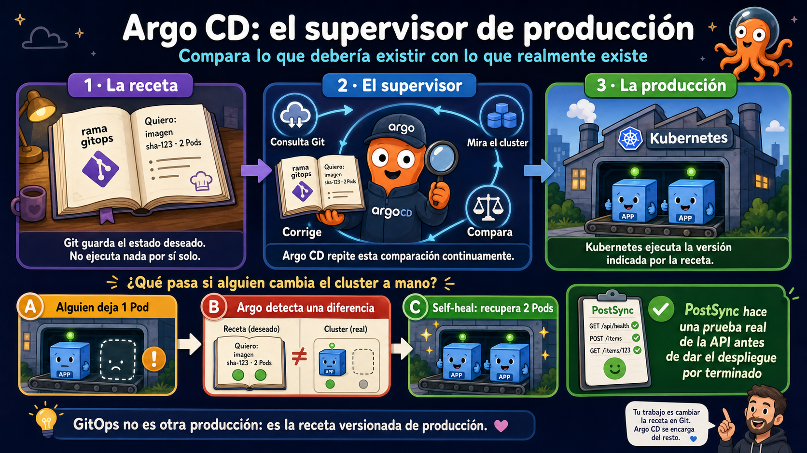

# Práctica: CI/CD con GitHub Actions, Docker y Argo CD


## Antes de empezar: ¿qué estamos construyendo?

El objetivo no es memorizar comandos. El objetivo es que un cambio recorra un
camino controlado desde tu computadora hasta producción:



Hay dos automatizaciones diferentes:

| Parte | Pregunta que responde | Herramienta |
| --- | --- | --- |
| CI: integración continua | ¿Este cambio tiene calidad suficiente para integrarlo? | GitHub Actions |
| CD: entrega y despliegue continuo | ¿Qué versión debe estar ejecutándose y coincide con el cluster? | GitHub Actions + Argo CD |

Cuando abres un pull request, GitHub crea una computadora temporal llamada
**runner**. En ella ejecuta análisis estático, unit tests, Docker Compose,
regresión HTTP y validación de manifiestos Kubernetes. Si todo pasa, el PR queda
listo para merge.

Cuando haces merge a `main`, GitHub repite los controles, construye una imagen
Docker inmutable, la publica en GHCR y actualiza la rama `gitops`. Argo CD ve ese
cambio y hace que Kubernetes ejecute exactamente esa versión.

### Las piezas, en lenguaje simple

- **Aplicación Flask:** el producto que estamos entregando.
- **Dockerfile:** la receta para empaquetar la aplicación.
- **Docker Compose:** un ambiente descartable para probar la aplicación completa.
- **GitHub Actions:** el operario que ejecuta los controles y publica la imagen.
- **GHCR:** el depósito donde se guardan las imágenes Docker.
- **Kubernetes:** el lugar donde se ejecuta producción.
- **Rama `gitops`:** la descripción versionada de cómo debería verse producción.
- **Argo CD:** el supervisor que compara esa descripción con el cluster y corrige
  las diferencias.

GitHub Actions no se conecta a tu computadora. Tu cluster local tampoco queda
expuesto a Internet. Argo CD, ejecutándose dentro de Docker Desktop, consulta el
repositorio público en GitHub y descarga la imagen desde GHCR.

## Laboratorio 0: entrar a un runner en cinco minutos

Antes de estudiar todo el pipeline, mira dónde se ejecuta un GitHub Action.



Cuando un job usa `runs-on: ubuntu-latest`, GitHub crea una **máquina virtual
temporal**. El runner es el programa que recibe y ejecuta los steps dentro de
esa VM. No es el cluster local ni un contenedor Docker.

El workflow `Laboratorio 0 - entrar al runner` usa
[`mxschmitt/action-tmate`](https://github.com/mxschmitt/action-tmate) para abrir
una conexión SSH temporal a esa VM.

### Preparación de una sola vez

`limit-access-to-actor: true` permite entrar únicamente con una clave SSH
registrada en la cuenta que ejecutó el workflow. Si todavía no tienes una,
usa la guía de GitHub para
[generarla](https://docs.github.com/en/authentication/connecting-to-github-with-ssh/generating-a-new-ssh-key-and-adding-it-to-the-ssh-agent)
y [agregarla a tu cuenta](https://docs.github.com/en/authentication/connecting-to-github-with-ssh/adding-a-new-ssh-key-to-your-github-account).

### Entrar

1. Abre **Actions → Laboratorio 0 - entrar al runner**.
2. Selecciona **Run workflow → Run workflow**.
3. Abre el job **Abrir acceso SSH temporal**.
4. Abre el step **Abrir la sesión con tmate**.
5. Copia el comando que comienza con `ssh` y ejecútalo en tu terminal.

Ya estás dentro de una computadora temporal de GitHub. Ejecuta:

```console
whoami
pwd
uname -a
env
ls -la
```

Comprueba que el repositorio está en una ruta similar a:

```text
/home/runner/work/m3-clase6/m3-clase6
```

Para terminar el laboratorio y permitir que el job finalice:

```console
sudo touch /continue
```

La VM se elimina al terminar el job. Los archivos o cambios hechos dentro de
ella no aparecen en tu computadora ni quedan disponibles para la siguiente
ejecución.

> No muestres ni copies tokens, claves o contraseñas durante la sesión. El
> workflow tiene permisos de solo lectura y se cierra automáticamente después
> de 15 minutos.

## Requisitos

- Cuenta de GitHub.
- Git.
- Docker Desktop.
- Kubernetes habilitado en Docker Desktop.
- `kubectl`.

Comprueba las herramientas:

```console
git --version
docker version
docker compose version
kubectl version --client
kubectl config get-contexts
```

## 1. Crear tu repositorio

1. Abre este repositorio en GitHub.
2. Selecciona **Use this template → Create a new repository**.
3. Selecciona tu cuenta personal como propietario, no `formatec-c4`.
4. Usa el nombre `m3-clase6`.
5. Selecciona **Public**.
6. Crea el repositorio.

El repositorio nuevo no mantiene relación de fork con el repositorio original.

Clónalo:

```console
git clone https://github.com/TU_USUARIO/m3-clase6.git
cd m3-clase6
```

## 2. Preparar el repositorio para Argo CD

Abre `gitops/argocd/application.yaml` y reemplaza:

```yaml
repoURL: __REPO_URL__
```

por la dirección pública de tu repositorio:

```yaml
repoURL: https://github.com/TU_USUARIO/m3-clase6.git
```

Guarda y sube el cambio:

```console
git add gitops/argocd/application.yaml
git commit -m "config: definir repositorio GitOps"
git push origin main
```

## 3. Crear la rama GitOps

La rama `gitops` no es un segundo programa ni el cluster. Es un documento de
estado: indica qué imagen, configuración y cantidad de réplicas debería tener
producción.

| Rama | Quién la cambia | Qué contiene |
| --- | --- | --- |
| `main` | Los alumnos mediante PR | Código, tests y recetas de despliegue |
| `gitops` | GitHub Actions | La versión exacta aprobada para producción |

Argo CD lee `gitops`; por eso se puede decir que esta rama es la **fuente de
verdad de producción**, pero no es producción. La producción real son los
contenedores que Kubernetes ejecuta.

```console
git switch -c gitops
git push -u origin gitops
git switch main
```

No trabajes directamente sobre `gitops`. GitHub Actions la actualizará.

Si intentas consultarla antes de crearla, Git responderá
`couldn't find remote ref gitops`. No es un problema de Argo CD: la rama todavía
no existe.

## 4. Configurar GitHub Actions

En tu repositorio:

1. Abre **Actions** y habilita los workflows si GitHub lo solicita.
2. Abre **Settings → Actions → General**.
3. Busca **Workflow permissions**.
4. Selecciona **Read and write permissions**.
5. Guarda.

Después crea el entorno:

1. Abre **Settings → Environments**.
2. Selecciona **New environment**.
3. Usa el nombre `production`.
4. Guarda.

No necesitas tokens ni secrets personales.

## 5. Ejecutar el pipeline por primera vez

1. Abre **Actions**.
2. Selecciona **CI/CD**.
3. Selecciona **Run workflow**.
4. Usa la rama `main`.
5. Ejecuta el workflow.

Debes ver estos jobs:

```text
1 · Análisis estático y unit tests
2 · Docker Compose y regresión
3 · Validar manifiestos de Kubernetes
4 · Publicar imagen
5 · Promover estado GitOps
```

El segundo job levanta la API con `compose.yaml`, ejecuta cuatro pruebas HTTP y
destruye el entorno al terminar.

El tercer job renderiza lo que Kubernetes recibiría y lo valida contra sus
esquemas. Así un PR no puede quedar verde si, por ejemplo, contiene una clave
inválida en un Deployment.

## 6. Hacer pública la imagen

GitHub puede crear el primer package de GHCR como privado. El cluster necesita
descargarlo sin credenciales.

1. Abre tu perfil de GitHub.
2. Selecciona **Packages**.
3. Abre `m3-clase6`.
4. Selecciona **Package settings**.
5. Busca **Change visibility**.
6. Cambia la visibilidad a **Public**.

Este paso se realiza una sola vez.

Comprueba la rama actualizada:

```console
git fetch origin gitops
git show origin/gitops:gitops/production/kustomization.yaml
```

`newName` debe apuntar a tu usuario y `newTag` debe comenzar con `sha-`.

## 7. Instalar Argo CD

### ¿Qué hace Argo CD?



Argo CD ejecuta continuamente este ciclo:

1. Lee en GitHub el estado deseado de la rama `gitops`.
2. Lee el estado real del cluster Kubernetes.
3. Compara ambos estados.
4. Si son distintos, sincroniza el cluster.
5. Comprueba que los recursos queden saludables.

Esto se llama **GitOps**: Git guarda la decisión de despliegue y el cluster se
reconcilia con ella. GitHub Actions no necesita entrar a tu red ni conocer las
credenciales de tu Kubernetes local.

Todos los comandos son explícitos. No hay un script de instalación.

Selecciona el cluster:

```console
kubectl config use-context docker-desktop
kubectl config current-context
kubectl wait node --all --for=condition=Ready --timeout=120s
```

El segundo comando debe responder exactamente `docker-desktop`. Si responde
otro nombre, detente: cualquier `kubectl apply` se ejecutaría sobre otro cluster
o fallaría porque allí no existe Argo CD.

Crea el namespace:

```console
kubectl create namespace argocd
```

Instala Argo CD:

```console
kubectl apply --namespace argocd --server-side --force-conflicts --filename https://raw.githubusercontent.com/argoproj/argo-cd/v3.4.5/manifests/install.yaml
```

Espera los componentes:

```console
kubectl wait --namespace argocd --for=condition=Available deployment --all --timeout=300s
kubectl rollout status --namespace argocd statefulset/argocd-application-controller --timeout=300s
kubectl get pods --namespace argocd
```

Todos los Pods deben quedar `Running`.

## 8. Registrar la aplicación

Aplica el archivo que editaste:

```console
kubectl apply --filename gitops/argocd/application.yaml
```

Consulta el estado:

```console
kubectl get application formatec-production --namespace argocd
```

Argo CD consulta GitHub periódicamente. Espera hasta obtener:

```text
SYNC STATUS   HEALTH STATUS
Synced        Healthy
```

Para actualizar la consulta:

```console
kubectl get application formatec-production --namespace argocd --watch
```

Sal con `Ctrl+C`.

### Laboratorio: abrir Argo CD y entender su pantalla

Primero obtén la contraseña inicial.

En macOS o Linux:

```console
kubectl get secret argocd-initial-admin-secret --namespace argocd --output=jsonpath="{.data.password}" | base64 --decode
```

En Windows PowerShell:

```powershell
$encoded = kubectl get secret argocd-initial-admin-secret --namespace argocd --output=jsonpath="{.data.password}"
[Text.Encoding]::UTF8.GetString([Convert]::FromBase64String($encoded))
```

Ahora publica la interfaz únicamente en tu propia computadora:

```console
kubectl port-forward --namespace argocd service/argocd-server 8443:443
```

1. Abre `https://127.0.0.1:8443`.
2. Acepta la advertencia del certificado local.
3. Ingresa con usuario `admin` y la contraseña anterior.
4. Abre la aplicación `formatec-production`.

Busca estas partes en la pantalla:

| Dato | Qué significa | Resultado esperado |
| --- | --- | --- |
| Sync status | Si el cluster coincide con Git | `Synced` |
| Health status | Si la aplicación funciona | `Healthy` |
| Revision | El commit de `gitops` observado | Un SHA |
| Resource tree | Los objetos creados en Kubernetes | Deployment, Service, Pods y Job |
| History and rollback | Las versiones que Argo desplegó | Al menos una sincronización |

Haz clic en un Pod y abre **Logs**. Luego abre el Deployment y observa la imagen
`ghcr.io/...:sha-...`. El árbol no es una decoración: muestra qué recurso creó a
cuál y permite localizar dónde se rompió un despliegue.

Detén el port-forward con `Ctrl+C`. Argo CD sigue funcionando; solamente cerraste
el acceso temporal desde el navegador.

### Ejercicio: ver la autocorrección de Argo CD

La configuración pide dos réplicas. Cambia manualmente el cluster a una:

```console
kubectl scale deployment formatec-api --namespace production --replicas=1
kubectl get deployment formatec-api --namespace production --watch
```

Argo CD detectará la diferencia y volverá a dejar `2/2`. Sal con `Ctrl+C`.
La detección no siempre es instantánea; espera hasta tres minutos.

La lección es importante: un cambio manual en Kubernetes no queda registrado y
Argo lo revierte. Para hacer un cambio permanente, se modifica el repositorio,
pasa por CI y termina en `gitops`.

## 9. Comprobar el despliegue

```console
kubectl get deployment --namespace production
kubectl get pods --namespace production
kubectl get service --namespace production
kubectl get ingress --namespace production
```

Resultado esperado:

- Deployment `formatec-api` con `2/2` réplicas.
- Dos Pods `Running`.
- Service `formatec-api` de tipo `ClusterIP`.
- Ningún Ingress.

Comprueba la imagen desplegada:

```console
kubectl get deployment formatec-api --namespace production --output=jsonpath={.spec.template.spec.containers[0].image}
```

Debe mostrar:

```text
ghcr.io/TU_USUARIO/m3-clase6:sha-<commit>
```

## 10. Comprobar el PostSync

El manifiesto `k8s/base/smoke-test.yaml` define un Job de Argo CD con el hook
`PostSync`.

Consulta el último resultado:

```console
kubectl get application formatec-production --namespace argocd --output=jsonpath={.status.operationState.phase}
```

Debe responder:

```text
Succeeded
```

El Job comprueba `/health` y `/api/stages` después del rollout.

## 11. Abrir la API localmente

Inicia un port-forward:

```console
kubectl port-forward --namespace production --address 127.0.0.1 service/formatec-api 8080:80
```

Abre en el navegador:

- `http://127.0.0.1:8080/health`
- `http://127.0.0.1:8080/api/stages`
- `http://127.0.0.1:8080/api/progress?completed=3`

`/health` debe devolver un resultado similar a:

```json
{
  "environment": "production",
  "status": "ok",
  "version": "sha-<commit>"
}
```

Detén el port-forward con `Ctrl+C`. Al detenerlo, la API deja de ser accesible
desde tu navegador.

## 12. Probar el flujo de pull request

Crea una rama:

```console
git switch main
git pull
git switch -c feature/regresion
```

En `app/__init__.py`, cambia:

```python
"percentage": calculate_progress(completed, len(STAGES)),
```

por:

```python
"percent": calculate_progress(completed, len(STAGES)),
```

Sube la rama:

```console
git add app/__init__.py
git commit -m "test: introducir regresion"
git push -u origin feature/regresion
```

Abre un PR hacia `main`.

Resultado esperado:

```text
1 · Análisis estático y unit tests   success
2 · Docker Compose y regresión       failure
3 · Validar manifiestos de Kubernetes success
Listo para merge                     failure
```

Restaura `percentage`, crea otro commit y vuelve a subir.

Resultado esperado:

```text
1 · Análisis estático y unit tests   success
2 · Docker Compose y regresión       success
3 · Validar manifiestos de Kubernetes success
Listo para merge                     success
```

Todavía no hagas merge. Ahora agrega una funcionalidad real en el mismo PR.

### Agregar un endpoint nuevo

En `app/__init__.py`, dentro de `create_app()` y antes de `return app`, agrega:

```python
    @app.get("/api/info")
    def info():
        return jsonify(
            {
                "name": "FormaTEC CI/CD API",
                "stages": len(STAGES),
            }
        )
```

En el diccionario `documentation` del endpoint `/`, agrega:

```python
"info": "/api/info",
```

La funcionalidad es compatible: no modifica ninguna respuesta existente.

### Agregar el unit test

Al final de `tests/unit/test_app.py`, agrega:

```python
def test_info_reports_service_metadata(client):
    response = client.get("/api/info")

    assert response.status_code == 200
    assert response.get_json() == {
        "name": "FormaTEC CI/CD API",
        "stages": 5,
    }
```

### Agregar la regresión HTTP

Al final de `tests/regression/test_api_contract.py`, agrega:

```python
@pytest.mark.regression
def test_info_endpoint_is_available():
    response = requests.get(f"{BASE_URL}/api/info", timeout=TIMEOUT)

    assert response.status_code == 200
    assert response.json() == {
        "name": "FormaTEC CI/CD API",
        "stages": 5,
    }
```

Sube el cambio:

```console
git add app/__init__.py tests/unit/test_app.py tests/regression/test_api_contract.py
git commit -m "feat: agregar endpoint de informacion"
git push
```

El mismo PR debe volver a quedar verde:

```text
1 · Análisis estático y unit tests   success
2 · Docker Compose y regresión       success
3 · Validar manifiestos de Kubernetes success
Listo para merge                     success
```

### Comprobar que también se protege el despliegue

Todavía en el mismo PR, abre `k8s/base/deployment.yaml` y cambia:

```yaml
replicas: 2
```

por:

```yaml
replicas: dos
```

Crea un commit y súbelo. La aplicación y sus tests siguen siendo correctos,
pero el manifiesto no cumple el contrato de Kubernetes:

```text
1 · Análisis estático y unit tests    success
2 · Docker Compose y regresión        success
3 · Validar manifiestos de Kubernetes failure
Listo para merge                      failure
```

Esto demuestra por qué “pasaron todos los tests” no significa necesariamente
“se puede desplegar”. Restaura `replicas: 2`, crea otro commit y comprueba que
todo vuelva a verde.

Ahora haz merge. La ejecución de `main` publicará otra imagen, actualizará
`gitops` y Argo CD desplegará el nuevo SHA.

Después del despliegue, abre:

```text
http://127.0.0.1:8080/api/info
```

Debes recibir:

```json
{
  "name": "FormaTEC CI/CD API",
  "stages": 5
}
```

## Diagnóstico: identificar en qué tramo falló

No pruebes comandos al azar. Primero ubica el tramo del flujo:

| Síntoma | Causa probable | Qué comprobar |
| --- | --- | --- |
| Falla `Docker Compose y regresión` | La API cambió su contrato o no inicia | Logs del job y `docker compose logs` |
| Falla `Validar manifiestos` | YAML o recurso Kubernetes inválido | Detalle de Kubeconform en el job |
| Falla `Publicar imagen` con `write_package` | Actions no tiene permiso para GHCR | **Settings → Actions → Workflow permissions → Read and write** |
| `couldn't find remote ref gitops` | La rama todavía no fue creada | Repite el paso 3 y confirma en **Code → Branches** |
| `the server doesn't have a resource type "application"` | Estás en otro cluster o Argo CD no está instalado | `kubectl config current-context` y Pods de `argocd` |
| `ImagePullBackOff` | GHCR no permite descargar la imagen | Haz público el package y revisa el nombre de imagen |
| Argo muestra `OutOfSync` | Git y Kubernetes no coinciden | Abre **Diff** en Argo CD |
| Argo muestra `Degraded` | El recurso se aplicó, pero no está saludable | Árbol de recursos, eventos y logs del Pod |

Para investigar un Pod:

```console
kubectl get pods --namespace production
kubectl describe pod NOMBRE_DEL_POD --namespace production
kubectl logs NOMBRE_DEL_POD --namespace production
```

Para investigar Argo CD:

```console
kubectl config current-context
kubectl get pods --namespace argocd
kubectl describe application formatec-production --namespace argocd
```

En las ejecuciones revisadas durante la preparación de esta práctica, el fallo
histórico de publicación no era un test: GHCR rechazaba la escritura del
package. Una ejecución posterior, con los permisos corregidos, terminó bien.
También se detectó que un `kubectl apply` puede apuntar accidentalmente a otro
contexto. Por eso la guía ahora exige comprobar `docker-desktop` y el pipeline
valida los manifiestos antes del merge.

## Reiniciar la práctica

Eliminar la aplicación:

```console
kubectl delete application formatec-production --namespace argocd
kubectl delete namespace production --ignore-not-found
```

Eliminar también Argo CD:

```console
kubectl delete namespace argocd
```
